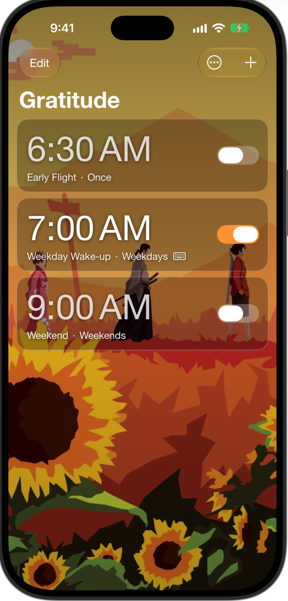

# Jatari ("Gratitude")

<p align="center"></p>

An iOS alarm clock with two kinds of alarm:

| | Normal alarm | Phrase alarm |
| --- | --- | --- |
| Turned on by | "Require phrase to stop" **off** | "Require phrase to stop" **on**, with a phrase of 8+ characters |
| Alert buttons | **Stop** (turns it off) and **Snooze** (rings again after 3 minutes) | **Stop** only, which opens the app to the phrase screen. **No snooze** |
| Ends when | You press Stop | You type the phrase correctly |

There is no default phrase: an alarm only has a phrase challenge if you turn it on and choose the phrase.

- 7 built-in tones (`SOUNDS.md`) and 3 sample alarms on first launch (one phrase alarm, two normal)
- Import your own sound from Files (converted to CAF, trimmed to 30 s, previewable, renameable, deletable)
- Optional strict (case/punctuation) phrase matching; paste is disabled in the phrase field
- Delete alarms with swipe, the Edit button, press-and-hold, or the Delete button in the editor

## How ringing works
1. Alarms are scheduled with **AlarmKit** (rings through silent mode and Focus, shows on the lock screen).
2. **Normal alarms** use AlarmKit's countdown behavior for Snooze (`AlarmTiming.snoozeSeconds` = 180 s). The system handles
   Stop and Snooze; the app isn't involved. The **PhraseAlarmWidgets** extension draws the snooze countdown Live Activity.
3. **Phrase alarms** have no secondary button. Stop runs `StopAlarmIntent` (`openAppWhenRun`), which opens the app to the
   phrase screen and **keeps ringing from inside the app**. Stop alone can never end a phrase alarm, because a chain of
   backup AlarmKit alarms (one every 60 s, up to 10) is armed *before* the alarm fires and is pushed out again on every Stop.
   This works on a locked phone, where Stop can't open the app: the next backup simply rings. A silent time-sensitive
   notification ("Unlock and type your phrase") is also posted. On unlock the app goes straight to the phrase screen.
   Only the correct phrase cancels the chain (it is also cancelled if the alarm is deleted or turned off). The chain covers the
   next occurrence of each alarm and is refreshed whenever the app launches, comes to the foreground or an alarm is solved.
4. If AlarmKit access is denied, the app falls back to local notifications: normal alarms get one notification with a
   Snooze action (3 min); phrase alarms get a chain of notifications every 60 s until the phrase is typed.
5. If a ringing alarm's record no longer exists (for example it was deleted), the app ends it cleanly rather than leaving you
   on a screen with nothing to type.

## Limits (iOS)
- Nothing can stop you **force-quitting the app, switching the phone off, or muting/lowering volume** where the system
  allows it. Sliding Stop on the lock screen can't be blocked; the alarm comes back within about 60 s instead. If you swipe the app away mid-way through a phrase alarm, the backup alarm / notification chain still fires
  and reopens the flow, but it can't be made unkillable.
- Alarm and notification sounds are limited to 30 s.
- The notification fallback is only as loud as the user's notification settings.

## Project layout
- `MyApp/`: the app. `Shared/`: code compiled into both the app and the widget extension (`PhraseAlarmMetadata`, `AlarmTiming`).
- `PhraseAlarmWidgets/`: Widget Extension for AlarmKit's Live Activity. `PhraseAlarmTests/`: unit tests.

## Build & test
```
xcodebuild -project "Untitled Project.xcodeproj" -scheme MyApp -destination 'id=<iOS 27 simulator id>' test
```
Launch flags for screenshots: `-previewList`, `-previewEditMode`, `-previewEditor` (phrase alarm), `-previewEditorNormal`,
`-previewEditorBottom`, `-previewDeleteConfirm`, `-previewRinging`.

## Setup
1. Open `Untitled Project.xcodeproj` in Xcode 27 or later (the deployment target is iOS 27).
2. The project file carries the original author's Apple Development Team and bundle IDs
   (`com.ashtondias.PhraseAlarm`, `.Widgets`, `.PhraseAlarmTests`). In **Signing & Capabilities**, pick your own Team and change the
   bundle IDs for the **MyApp**, **PhraseAlarmWidgets** and **PhraseAlarmTests** targets (keep the widget's ID prefixed with the app's).
3. Run on an iPhone to test real alarms. The simulator can't ring through silent mode or the lock screen.

## Artwork
The background and app icon are **third-party artwork, not original to this project**: the app icon is the cover art of the
*Samurai Champloo Music Record* album, and the background is Samurai Champloo-themed fan art. They are included only so the app looks
as it does in the screenshot, and they are **not covered by this project's license**. If you fork, redistribute or publish a build
(for example to the App Store), replace both with artwork you have the rights to. To use your own:
- **Background:** replace `MyApp/Assets.xcassets/AppBackground.imageset/background.jpg` with any portrait image (about 736×1117 works well).
  Text on top is white, so darker or mid-tone images read best.
- **App icon:** replace `MyApp/Assets.xcassets/AppIcon.appiconset/icon-1024.png` with a **1024×1024 PNG with no transparency**, or put a source
  image at `tools/icon-source/source.jpeg` and run `python3 tools/make_icon.py` (needs Pillow). iOS rounds the corners itself.
